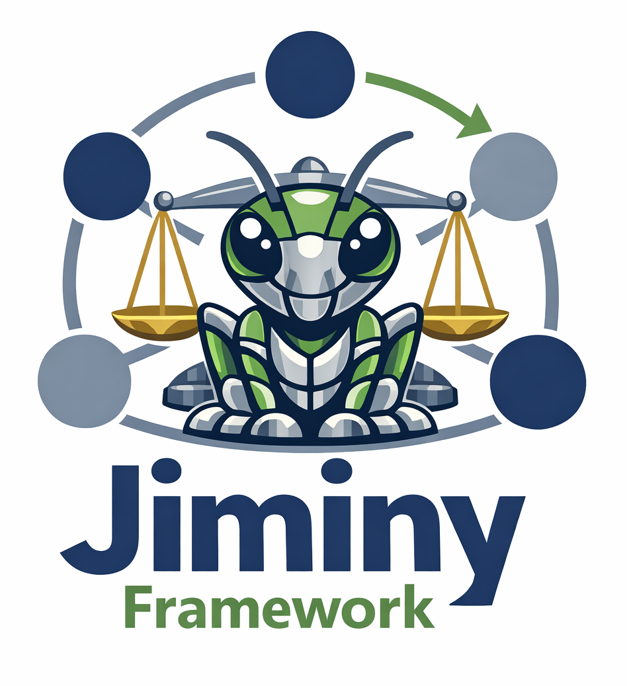

# Jiminy Framework

**Jiminy Framework** is an open research initiative focused on the development of **normative reasoning systems for autonomous agents**.

The project explores how robots and intelligent systems can **reason about norms, detect conflicts between obligations and permissions, and produce explainable moral decisions**.

The organisation hosts the core framework and related experimental developments.

---

# What is Jiminy?

Jiminy is a **normative argumentation engine** designed for research in:

- machine ethics
- explainable AI
- normative reasoning
- autonomous systems
- human-robot interaction

The framework enables autonomous agents to:

- generate arguments from norms and contextual facts
- detect normative conflicts
- resolve them using different reasoning semantics
- provide structured explanations of decisions

---

# Core Repository

## Jiminy Framework

The main implementation of the engine.

Features include:

- argument generation from norms
- conflict detection
- multiple semantics (naive, priority, Jiminy)
- YAML scenario modelling
- argumentation graph visualisation
- testing framework for semantic validation

---

# Research Vision

Jiminy explores how **normative reasoning can support safe and explainable autonomy** in robotics and AI systems.

The project investigates:

- normative multi-stakeholder reasoning
- explainable decision making
- structured argumentation in robotics
- ethical conflict resolution
- transparent AI behaviour

---

# Organisation Repositories

This organisation may host additional repositories related to the Jiminy ecosystem, such as:

- experimental reasoning modules
- scenario collections
- simulation environments
- explainability interfaces
- robotics integrations

---

# Contributing

We welcome contributions from researchers and developers interested in:

- normative reasoning
- argumentation systems
- explainable AI
- robotics and autonomy

Please see the contribution guidelines in each repository.

---

# Contact

For questions, collaborations, or research inquiries, please open an issue or discussion in the relevant repository.

---
